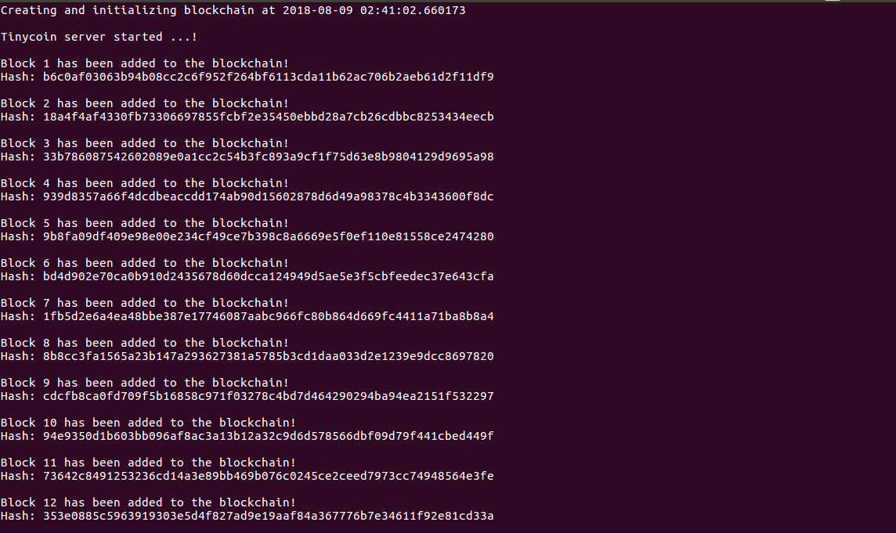

# Tinycoin

This project is created to learn blockchain by creating a small blockchain and it's own coin. 

# Prerequisite
- Python >= 3.6 

If you are running other python versions, this project can be ported to other python versions with small syntax changes.

# How to run?

- `git clone https://github.com/prakashpandey/tinycoin`

- `cd tinycoin`

- `pip install -r requirement.txt` or `pip3 install -r requirement.txt` based on your `pip` version


#### '.*NIX' based systems

- `./start.sh`

Note: If your environment uses `python3` instead of `python` then edit the `start.sh` script.

#### Windows system

- set `HOST`, `PORT`, `PEERS` and `MINER_ADDRESS` environment variables. 
  Follow `Configuration` section for more details.

- python src/app.py

By default the application will run on port `5000`


# Configuration

Open file `start.sh`. 
You can set the values of following environment variables according to your needs.

- `HOST="http://127.0.0.1"`

- `PORT=5000`

- `PEERS="http://192.168.1.11:5000,http://192.168.1.12:5000"`

- `MINER_ADDRESS="ppdpp-dvfgf-fredgdsdf-gdsfgsd-35vr433-ee2eass4d"`

# API'S

##### Create a transaction

- `Method = Post`
- `Url = 127.0.0.1:5000/transaction`
- Body 
    ```
        {
            "from": "71238uqirbfh894-random-public-key-a-alkjdflakjfewn204ij",
            "to": "ppdpp-dvfgf-fredgdsdf-gdsfgsd-35vr433-ee2eass4d",
            "amount": 2
        }
    ```
- Headers: `Content-Type=application/json`
- API response `Transaction submission successful` or `Transaction unsuccessful`

##### Start mining

- `Method = Get`

- `Url = localhost:5000/mine`

- API response `Mined block in JSON format`

##### Get blocks

- `Method = Get`

- `Url = localhost:5000/blocks`

- API response `Blockchain in JSON format`

##### Consensus

- `Method = Get`

- `Url = localhost:5000/consensus`

- API response `Consensus successfully done`

##### Get peers of a node

- `Method = Get`

- `Url = localhost:5000/peers`

- API response `["http://127.0.0.1:5001", "http://127.0.0.1:5002"]`

##### Connect to all peers of peers

- `Method = Get`

- `Url = localhost:5000/connect_to_peers_of_peers`

- API response `["http://127.0.0.1:5002", "http://127.0.0.1:5000"]`

# What more can be done?

The only aim creating this project is to learn and explore about blockchain.
Currently the consensus and proof of work algorithms are very simple. There is scope of improving these algorithm.

##### Future updates

- A wallet client 

- Update proof of work and consensus algorithm

- A valid miner address validater

# Project Screenshot 



# Resource
This learning project is created just for learning and based on open blog articles on internet.

